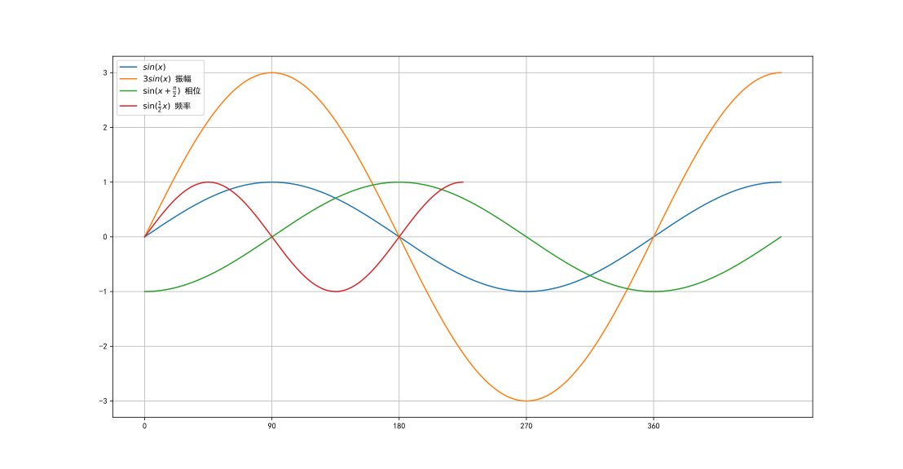

# 信道带宽

#### 模拟信道
<!--最大的频率-最小的频率-->
$$
W=f_2-f_1
$$
#### 数字信道
<!--W为信道带宽 -->
$$
尼奎斯特定理,B=2W(Baud) \\
一个码元携带的信息量n位与码元的种类数N有,n=\log_2N \\
比特率=B\cdot \log_{2}N
$$
<!--W为信道带宽 S为信号的平均功率 N为噪声的平均功率 -->
$$
香农定理,C=W\log_2(1+\frac{S}{N}) \\
分贝与噪声比的关系,dB=10\log_{10}\frac{S}{N}
$$

# 数字调制

$$
振幅键控(Amplitude- Shift\quad Keying)\\
相位键控(Phase- Shift\quad Keying)\\
频移键控(Frequency - Shift\quad Keying)
$$

$$
\begin{split}
&y=A\sin(\omega x+\varphi)+D\\
&A表示振幅(待插入图片)\\
&-\frac{\varphi}{\omega}表示x的相位(待插入图片)\\
&D表示垂直相位(待插入图片)\\
&T=\frac{2\pi}{\omega},周期=\frac{2\pi}{频率} (待插入图片)  
\end{split}
$$