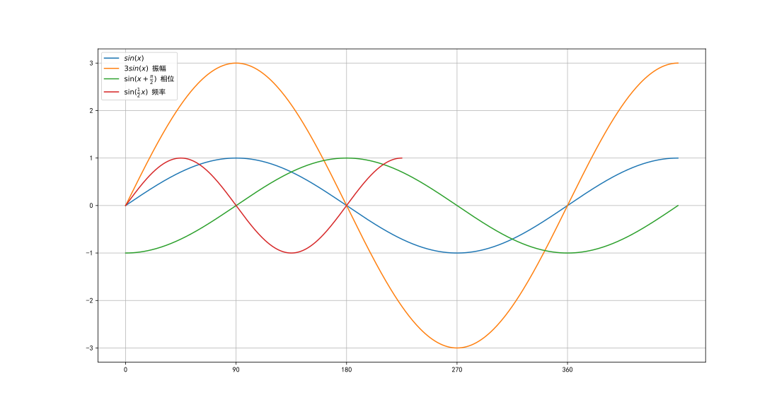

# 信道带宽
---
#### 赫兹(Hz)
- ***赫兹（Hz）*** 是频率的单位，表示每秒的周期数（cycles per second）。例如，1 Hz 表示每秒发生1次周期性变化。

- 在通信中，频率指电磁波或信号在单位时间内的振荡次数。高频信号（如 GHz）能承载更多信息，但传播距离可能受限；低频信号（如 kHz）传播更远，但信息容量较低。
---
#### 模拟信道
<!--最大的频率-最小的频率-->
$
W=f_2-f_1
$
---
#### 数字信道
<!--W为信道带宽 -->
$
尼奎斯特定理,B=2W(Baud) \\
一个码元携带的信息量n位与码元的种类数N有,n=\log_2N \\
比特率=B\cdot \log_{2}N
$

$
香农定理,C=W\log_2(1+\frac{S}{N}) \\
分贝与噪声比的关系,dB=10\log_{10}\frac{S}{N}
$
> W为信道带宽(hz) S为信号的平均功率 N为噪声的平均功率
---

# 数字调制

$$
振幅键控(Amplitude- Shift\quad Keying)\\
相位键控(Phase- Shift\quad Keying)\\
频移键控(Frequency - Shift\quad Keying)
$$

$$
\begin{split}
&y=A\sin(\omega x+\varphi)+D\\
&A表示振幅(待插入图片)\\
&-\frac{\varphi}{\omega}表示x的相位(待插入图片)\\
&D表示垂直相位(待插入图片)\\
&T=\frac{2\pi}{\omega},周期=\frac{2\pi}{频率} (待插入图片)  
\end{split}
$$

$
QAM(Quadrature Amplitude Modulation)正交幅度调制
$
[QAM](https://info.support.huawei.com/info-finder/encyclopedia/zh/QAM.html)

# 脉冲调制(pulse code modulation)

1. 取样
     - 每隔一定时间，取模拟信号的当前值作为样本，该样本代表模拟型号在某一瞬间时刻的值。
     - 麦奎斯特取样定理：取样速率大于模拟信号最高频率的两倍，则可以用得到的样本空间恢复原本的模拟信号
     - $f=\frac{1}{T}>2f_{max}$

        $f=\frac{1}{T}为采样频率（取样周期）f_{max}为信号最高频率$

2. 量化
   - 取样后得到的样本是连续纸，必须把其转化为离散值，离散值的个数决定了量化的精度。

3. 编码
   - 把量化的样本值变成相应的二进制代码

例如语音通话的最高频率是4kHz,则采样频率是8kHz。对语音样本用256个样化等级，所以每个样化样本用8个二进制数表示，**在数字信道上**传输这种数字化的语音信号的传输速率为$8bit\cdot8kHz=64kbps$
>数据速率=每个样化样本的二进制数*采样频率

# 交换方式

### 电路交换

# TCP(滑动窗口大小)
[RWND](https://blog.csdn.net/z302766296/article/details/111318920)