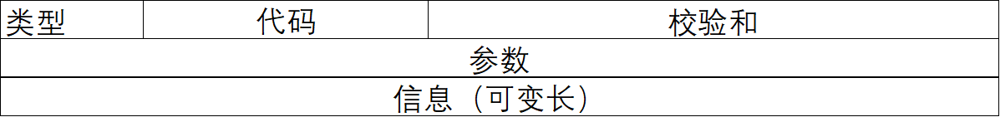

# 广域网技术

## 公用电话网
- 公共交换电话网(Public Switched Telephone Network,PSTN)是为了话音通信而建立的网
络，从20世纪 60年代开始又被用于数据传输。随着技术和需求的发展，各种专用的计算机网
络和公用数据网已能够提供更好的服务质量和更多样的通信业务，采用 PSTN 拨号的联网方式
已基本被淘汰

### 调制解调器
- 调制解调器(Modulation and Demodulation,Modem)的功能是把计算机产生的数字脉冲转
换为已调制的模拟信号或者将模拟信号变成计算机能接收的数字脉冲。现代的高速Modem采用
格码调制(Trellis Coded Modulation,TCM)技术。

## X.25公共数据网
  1. X.25分层
    - 公共数据网是在一个国家或全世界范围内提供公共电信服务的数据通信网。CCITT于1974年提出了访问分组交换网的协议标准，即X.25建议，后来又进行了多次修订。
    - 这个标准分为3个协议层，即**物理层、链路层和分组层**，分别对应于 ISO/OSI参考模型的低三层（物理层，数据链路层，网络层）。
        - **物理层**：规定用户终端与网络之间的物理接口(X.21或X.21bis)
        - **链路层**：提供可靠的数据传输功能，这一层的标准叫作LAP-B(Link Access Procedure-Balanced),它是HDLC的子集。
        - **分组层**：提供外部虚电路服务，这一层协议是X.25 建议的核心，特别称为X.25 PLP(Packet Layer Protocol)协议
            1. **X.25 PLP协议**提供两种虚电路服务
                - 交换虚电路：动态建立（按需建立）包括**呼叫建立、数据传输、呼叫拆除**等步骤
                - 永久虚电路：无须建立和清除连接，可直接传送数据。(双方计算机一启动就连接)
## ISDN和ATM
1. 综合业务数字网
   - ISDN用户接口：ISDN系统主要提供两种用户接口：基本速率2B+D和基群速率30B+D（B信道是64kb/s的
话音或数据信道，而D信道是16kb/s或64kb/s的信令信道。）。
   - 窄带ISDN的缺点是数据速率太低，不适合视频信息等需要高带宽的应用，它仍然是一种**基于电路交换网**的技术。
   - 20世纪80年年代ITU-T开发宽带ISDN技术(B-ISDN)，基于分组交换技术的ATM技术
2. ATM
   - 它把用户数据组织成53字节长的信元(cell),从各种数据源随机到达的信元没有预定的顺序，而且信元之间可以有间隙，信元只要准备好就可以进入信道。在没有数据时，向信道发送空信元，或者发送OAM(Operation And Maimtenance)信元，**ATM 就是以信元为传输单位的<em>统计时分复用技术<em>**

## 帧中继网
   - 帧中继在第二层建立虚电路，用帧方式承载数据业务，因而第三层就被简化掉了。同时，FR的帧层也比 HDLC操作简单，只做检错，不再重传，没有滑动窗口式的流控，只有拥塞控制。
      1. 帧中继业务
         中继网络提供虚电路业务。虚电路是端到端的连接，不同的数据链路连接标识符(Data Link Conmectionldeatifier,DLCI)代表不同的虚电路。**在用户一网络接口**(UNI)上的 DLCI用于区分用户建立的不同虚电路，**在网络—网络接口**(NNI)上的DLCI用于区分网络之间的不同虚电路。
      2. 帧中继协议
         与 HDLC一样，帧中继采用帧作为传输的基本单位。帧中继协议叫作LAP-D(Q.921),它比LAP-B简单，省去了控制字段
         |01111110|地址|信息|FCS|01111110|
         |:---:|:---:|:---:|:---:|:---:|
         |1Byte |2-4Byte|长度可变|2Byte|1Byte
         
         01111110:标志字段，与HDLC一样
         两字节的地址：
         <table>
            <tr>
               <td colspan="3">DLCI(高位)</td>
               <td></td>
               <td></td>
               <td>C/R</td>
               <td>EA=0</td>
            </tr>
            <tr>
               <td colspan="3">DLCI(低位)</td>
               <td>FECN</td>
               <td>BECN</td>
               <td>DE</td>
               <td>EA=1</td>
            </tr>
         </table>

          - **EA:地址扩展位**，该位为0时表示地址向后扩展一个字节，为1时表示最后一个字节。
          - **C/R:命令/响应位**，协议本身不使用这个位，用户可以用这个位区分不同的帧。
          - **FECN:向前拥塞位**，若网络设备置该位为1,则表示在帧的传送方向上出现了拥塞，该帧到达接收端后，接收方可据此调整发送方的数据速率。
          - **BECN**:向后拥塞位，若网络设备置该位为1,则表示在与帧传送相反的方向上出现了拥塞，该帧到达发送端后，发送方可据此调整发送数据速率。
          - **DE**:优先丢弃位，当网络发生拥塞时，DE为1的帧被优先丢弃。
          - **DC**:该位仅在地址字段为3或4字节时使用。一般情况下DC为0,若DC为1,则表示最后一-个字节的3~8位不再解释为DLCI的低位，而被数据链路核心控制使用。
          - **DLCI**:数据链路连接标识符，在3种不同的地址格式中分别是10位、16位和23位。它们的取值范围和用途各不相同，有的虚电路传送数据，有的虚电路传送信令，还有的用于强化链路层管理。
      3. 帧中继的应用
         - 基于分组（帧）交换的透明传输，可提供面向连接的服务
         - 帧长可变(1600-4096字节),可以承载各种局域网的数据帧
         - 没有流控和重传机制，开销小
         - ······
         帧中继协议在第二层实现，没有专门的物理层接口定义，可以使用**X21、V35、G.703或G.704接口协议**
------

# IP协议

### IPv4数据包
<table style="text-align: center;">
   <tr>
      <td>版本</td>
      <td>首部长度</td>
      <td colspan="2">服务类型</td>
      <td colspan="4">总长度</td>
      <!-- <td>标识</td>
      <td>标志</td>
      <td>生存时间</td>
      <td>协议</td>
      <td>首部校验和</td>
      <td>源地址</td>
      <td>目的地址</td> -->
   </tr>
   <tr>
      <td colspan="4">biaoshifu</td>
      <td></td>
      <td>D</td>
      <td>M</td>
      <td>段偏置值</td>
   </tr>
   <tr>
      <td colspan="2">生存周期</td>
      <td colspan="2">协议</td>
      <td colspan="4">头校验和</td>
   </tr>
   <tr>
      <td colspan="8">源地址</td>
   </tr>
   <tr>
      <td colspan="8">目的地址</td>
   </tr>
   <tr>
      <td colspan="8">任选数据+补丁</td>
   </tr>
   <tr>
      <td colspan="8">用户数据</td>
   </tr>
</table>

 - IHL:IP头长度，以32位字计数，最小为5,即20个字节
 - 总长度：包含IP头在内的数据单元的总长度(字节数)
 - 标志：包括3个标志，一个是M标志，用于分段和重装配；另一个是禁止分段标志
 - 偏置值：指明该段处于原来数据报中的位置。
 - 协议：上层协议(TCP或UDP)。
 - 头校验和：校验和是对IP头中的所有16位字进行1的补码相加得到的，计算时假定校验和字段本身为0。

### IPv4地址
 IPv4网络地址采用“网络·主机”的形式，冒分十进制

### IPv4协议的操作
1. 控制数据包生存周期(TTL)
2. 分段和重装配
   - 报文ID字段
   - 数据长度：字节数
   - 偏置值：分段在原来报文中的位置，以8个字节的倍数计数
   - M标志：是否为最后一个分段
     1. 一个站发出数据报时对长度字段的赋值等于整个数据字段的长度，偏置值为0,M标志置 False(用0表示)。如果一个IP模块要对该报文分段，则按以下步骤进行：
        1. 对数据块的分段必须在64位的边界上划分，因而除最后一段外，其他段长都是64位的整数倍。
        2. 对得到的每一分段都加上原来数据报的IP头，组成短报文。
        3. 每一个短报文的长度字段置为它包含的字节数。
        4. 第一个短报文的偏置值置为0,其他短报文的偏置值为它前边所有报文长度之和(字节数)除以8。
        5. 最后一个报文的M标志置为0(False),其他报文的M标志置为1(True)。
3. 差错控制和流控
   - 无连接的网络操作不保证数据报的成功提交，当路由器丢弃一个数据报时，要尽可能地向源点返回一些信息。源点的IP实体可以根据收到的出错信息改变发送策略或者把情况报告上层协议。丢弃数据报的原因可能是超过生存期、网络拥塞和 FCS校验出错等。
<hr style="width:50%">

### ICMPv4
- ICMP报文封装在P数据报中传送，因而不保证可靠的提交

1. 数据包格式


2. 十五种```ICMP```差错报文

|类型 (Type)|编码 (Code)|description|
|:---:|:---:|:---:|
|0|0|回声应答 (ping)|
|3	|0|目的网络不可达
|3	|1|目的主机不可达
|3	|2|目的协议不可达
|3	|3|目的端口不可达
|3	|6|目的网络未知
|3	|7|目的主机未知
|4	|0|源抑制 (拥塞控制 - 未用)
|8	|0|回声请求 (ping)
|9	|0|路由通告
|10|0|路由发现
|11|0|TTL 超期
|12|0|IP 首部错误

| TYPE | CODE | Description | Query | Error |
|------|------|-------------|-------|-------|
| 0    | 0    | Echo Reply——回显应答（Ping应答） | x     |  |
| 3    | 0    | Network Unreachable——网络不可达 |  | x     |
| 3    | 1    | Host Unreachable——主机不可达 |  | x     |
| 3    | 2    | Protocol Unreachable——协议不可达 |  | x     |
| 3    | 3    | Port Unreachable——端口不可达 |  | x     |
| 3    | 4    | Fragmentation needed but no frag. bit set——需要进行分片但设置不分片比特 |  | x     |
| 3    | 5    | Source routing failed——源站选路失败 |  | x     |
| 3    | 6    | Destination network unknown——目的网络未知 |  | x     |
| 3    | 7    | Destination host unknown——目的主机未知 |  | x     |
| 3    | 8    | Source host isolated (obsolete)——源主机被隔离（作废不用） |  | x     |
| 3    | 9    | Destination network administratively prohibited——目的网络被强制禁止 |  | x     |
| 3    | 10   | Destination host administratively prohibited——目的主机被强制禁止 |  | x     |
| 3    | 11   | Network unreachable for TOS——由于服务类型TOS，网络不可达 |  | x     |
| 3    | 12   | Host unreachable for TOS——由于服务类型TOS，主机不可达 |  | x     |
| 3    | 13   | Communication administratively prohibited by filtering——由于过滤，通信被强制禁止 |  | x     |
| 3    | 14   | Host precedence violation——主机越权 |  | x     |
| 3    | 15   | Precedence cutoff in effect——优先中止生效 |  | x     |
| 4    | 0    | Source quench——源端被关闭（基本流控制） |  | x     |
| 5    | 0    | Redirect for network——对网络重定向 |  |  |
| 5    | 1    | Redirect for host——对主机重定向 |  |  |
| 5    | 2    | Redirect for TOS and network——对服务类型和网络重定向 |  |  |
| 5    | 3    | Redirect for TOS and host——对服务类型和主机重定向 |  |  |
| 8    | 0    | Echo request——回显请求（Ping请求） | x     |  |
| 9    | 0    | Router advertisement——路由器通告 |  |  |
| 10   | 0    | Route solicitation——路由器请求 |  |  |
| 11   | 0    | TTL equals 0 during transit——传输期间生存时间为0 |  | x     |
| 11   | 1    | TTL equals 0 during reassembly——在数据报组装期间生存时间为0 |  | x     |
| 12   | 0    | IP header bad (catchall error)——坏的IP首部（包括各种差错） |  | x     |
| 12   | 1    | Required options missing——缺少必需的选项 |  | x     |
| 13   | 0    | Timestamp request (obsolete)——时间戳请求（作废不用） | x     |  |
| 14   | 0    | Timestamp reply (obsolete)——时间戳应答（作废不用） | x     |  |
| 15   | 0    | Information request (obsolete)——信息请求（作废不用） | x     |  |
| 16   | 0    | Information reply (obsolete)——信息应答（作废不用） | x     |  |
| 17   | 0    | Address mask request——地址掩码请求 | x     |  |
| 18   | 0    | Address mask reply——地址掩码应答 | x     |  |
# IPv4到IPv6的过渡


# IP组播技术


# TCP和UDP协议


# 路由协议和路由器技术


# Internet应用